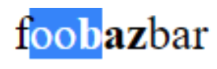

# Shadow Selection API Explainer

<p style="text-align: right">
author: masonf@chromium.org and <a href="mailto:yoichio@google.com">yoichio@google.com</a></p>

<p style="text-align: right">
last updated: 2021-08-23</p>

<p style="text-align: right">
visibility: public.</p>

<p style="text-align: right">
permission: comment</p>

# Overview


This is an updated and revised version of the original [ComposedSelection API Explainer](https://docs.google.com/document/d/1VuNe7kYK7p6hN7_ozWIbjTLbjU5ctsS0kFwKd1t-8h0) by [yoichio@google.com](mailto:yoichio@google.com). It has been updated to include some [changes agreed to at the 2018 TPAC meeting](https://github.com/WICG/webcomponents/issues/79#issuecomment-432974389), fix some things that have changed since 2018, and generally flesh out the rest of the API.

Shadow DOM (v1) is now supported by all evergreen rendering engines. However, the user selection APIs are not well supported for the case that the user selection crosses shadow boundaries. The existing [Selection API](http://w3c.github.io/selection-api/#dom-selection) specifies that there is only a single selection in a document and the selection is bound to a single [Range](https://dom.spec.whatwg.org/#range), which means that it cannot represent a range over the composed tree. Said another way, if the selection crosses shadow boundaries, the existing API cannot represent this situation correctly. For backwards compatibility, we also can't update the Selection API so that it can get/set nodes in other node trees.

This proposal suggests a new API that lets web authors control selections in the composed tree.


## Examples of problems that occur with the current APIs


### #1. Selecting inline shadow component.

Define inline style component:


```html
foo<span id=host></span>bar
<script>
let root = host.attachShadow({mode: 'open'});
root.innerHTML = `<b>baz</b>`;
</script>
```


This results in a rendered page similar to this:


      

And the user might select the visible text this way:


      

However, in this case, the web author can’t get the exact selection range.


```html
<script>
document.addEventListener("selectionchange", function() {
  window.getSelection(); // ??
});
</script>
```


The call to getSelection() in this case behaves differently on different rendering engines. In Chromium, it returns only the content from the DOM tree containing the selection **anchor**. So for the selection that starts between “f” and “o” and ends between “b” and “a”, it will return just “oo”. When selected in the other direction, it just returns “b”. Safari is similar, but will sometimes include the shadow content, if the selection endpoints are in different shadow trees. Gecko will simply **refuse to allow** the user to highlight as shown above - the selection itself is limited to one or the other tree.


### #2. Editor component in shadow.

The following several examples/cases contemplate an editor component, and its need for knowledge of the selection information:


```html
<script>
customElements.define('x-editor', class extends HTMLElement {
  connectedCallback() {
    let button = document.createElement('button');
    let div = document.createElement('div');
    div.contenteditable = true;
    div.innerHTML = "initial text - highlight me";
    this.appendChild(button);
    this.appendChild(div);
    button.innerText = "Delete selection";
    button.onclick = () => {
      let selection = window.getSelection();
      if (selection.rangeCount == 0) return;
      let range = selection.getRangeAt(0);
      range.deleteContents();
    };
  }
});
</script>
<x-editor></x-editor>
```


This creates an editor element with just a delete button, which deletes any highlighted content:


However, we can’t convert that component to use Shadow DOM:


```html
<script>
customElements.define('x-editor2', class extends HTMLElement {
  constructor() {
    super();
    let shadow = this.attachShadow({mode:"open"}); // Create shadow root.
    let button = document.createElement('button');
    let div = document.createElement('div');
    div.contenteditable = true;
    div.innerHTML = "initial text - highlight me";
    shadow.appendChild(button);
    shadow.appendChild(div);
    button.innerText = "Delete selection";
    button.onclick = () => {
      //let selection = window.getSelection(); // ! no shadow info
      //let selection = shadow.getSelection(); // ! not in Gecko or WebKit
      if (selection.rangeCount == 0) return;
      let range = selection.getRangeAt(0);
      range.deleteContents();
    };
  }
});
</script>
<x-editor2></x-editor2>

```


Here, window.getSelection() doesn’t work properly. It will not return selection information for the selection when it is inside a shadowRoot. In Chromium (only), there is a non-standard implementation of shadowRoot.getSelection() which will return selection information within the shadow root. In no case is the selection/range information correct when the selection spans two shadow trees.

The same problem happens when the (non-Shadow DOM) &lt;x-editor> component is nested inside another (Shadow DOM) component:


```html
<script>
customElements.define('photo-submit', class extends HTMLElement {
  constructor() {
    super();
    let shadow = this.attachShadow({mode:"open"});
    shadow.innerHTML = `<x-editor id="comment"></x-editor>
    <photo-uploader></photo-uploader>
    <foo-element></foo-element>`;
  }
});
</script>
<photo-submit></photo-submit>
```


In this case, the &lt;x-editor> selection information is no longer available, because the entire component is nested inside a Shadow Root.


# Proposal


## getComposedRange() API


```webIDL
partial interface Selection {
  StaticRange getComposedRange(optional sequence<ShadowRoot> closedRoots = []);
  undefined addRange(StaticRange rangeIncludingShadows);
  undefined setBaseAndExtent(Node anchorNode, unsigned long anchorOffset, Node focusNode, unsigned long focusOffset);
};
```


Essentially, a new API, `getComposedRange()`, can return a StaticRange with endpoints in different shadow trees. Because that can expose `Node`s inside shadow trees, an optional `closedRoots` parameter enables the method to return Nodes within the provided list of closed roots, if necessary. If a selection endpoint is within a non-provided closed shadow root, the returned selection will be made to appear as if the entire host element was selected.

In addition to this new API for retrieving the selection, the existing APIs within the Selection object will be updated to support setting selections that cross shadow boundaries. For example, the setBaseAndExtent() function will be augmented to support nodes in different shadow trees. And the addRange() function will accept a StaticRange argument that contains a shadow-crossing range.

Let’s see how these new APIs can be used with the problem examples above:


### #1. Selecting inline shadow component.


<h1>IN PROGRESS HERE - old content below</h1>

With the new API, the exact selection range can be accessed:


```html
<script>
document.addEventListener("selectionchange", function() {
  let range = window.getSelection().getComposedRange();
  console.log(range); // {"foo", 1, "baz", 1}
});
</script>
```


Also you can set such selection:


```html
<script>
let selection = window.getComposedSelection();
selection.setBaseAndExtent(foo, 1, baz, 1);
</script>
```


### #2’. Cases for closed shadow.

`"optional sequence&lt;ShadowRoot> disclosedShadows" `argument is need to access nodes inner closed ShadowRoot for the editor example:


```html
<script>
customElements.define('x-editor', class extends HTMLElement {
  constructor() {
    super();
    // Get Document or root ShadowRoot for this component.
    let root = this.getRootNode();
    input.onlick = () => {
      let selection = window.getComposedSelection();
      // Pass the root to create a selection to access nodes 
      // in (maybe) closed ShadowRoot.
      let selection_range = selection.getRange([root]);
      if (!selection_range) return;
      // If selection is not inside this tree, abort.
      if (!this.contains(selection_range.baseNode) ||
          !this.contains(selection_range.extentNode)) return;
      // ...
    };
  }

  long MyCursoroffset() {
   range = window.getComposedSelection().getRange([root]);
   /// (check if range is inside x-editor,,,)
   return range.anchorOffset - mybase_offset
  }
  void setMyCursorOffset(offset) {
   selection = window.getComposedSelection();   
   range = window.getComposedSelection().getRange([root]);    
   selection.setBaseAndExtent(
     range.BaseNode, offset + mybase_offset,
     range.BaseNode, offset + mybase_offset);
  }
});
</script>
<x-editor></x-editor>
```


disclosedShadows is needed because Web API must not expose nodes of closed ShadowRoot unless web author has its reference. 

Since SelectionRange’s baseNode and extentNode can be in different node tree, web author need to check if selection is inside the component.

This code works all cases where document has no shadows,  x-editor itself has ShadowRoot (x-editor2) or it is componentized inside ShadowRoot(photo-submit).


### ComposedSelection.getRange behavior

ComposedSelection.getRange() scopes original selection by shadow reachability.

Suppose we have following tree.

(the image also shows some boundary points for explanation.)


<h3>Tree drawing here</h3>

getRange() returns a range of boundary points so that each of them is host of the shallowest closed shadow of original boundary point.

Fallback boundary point is adopted so that new SelectionRange includes closed boundary point.

(SelectionRange(C,1,A,2) includes (I,1) but SelectionRange(C,1,A,1) doesn’t).

disclosedShadows argument enables to access nodes of the list instead of the host-fallbacking.

Example:


```html
<script>
let composedSelection = window.getComposedSelection();
composedSelection.setBaseAndExtent(C,1, I, 1);
composedSelection.getRange(); // [C,1,A,2]
composedSelection.getRange([G]); // [C,1,G,1]
composedSelection.getRange([I]); // [C,1,I,2] == original range.
</script>
```


## Existing Selection API compatibility

Let me call existing Selection API as “DocumentSelection” here.


### DocumentSelection->ComposedSelection

Since ComposedSelection can represent any Range, setting DocumentSelection and getting it through ComposeSelection keeps original range:


```html
<script>
let range = document.createRange();
range.setStart(a,x);
range.setEnd(b,y);
let documentSelection = document.getSelection();
documentSelection.addRange(range);
let composedSelection = window.getComposedSelection();
composedSelection.getRange(); // [a,x,b,y]
</script>
```


### ComposedSelection->DocumentSelection

We need to also update current Selection API specification.

If ComposeSelection sets SelectionRange that is compatible as Range, DocumentSelection returns same Range.


```html
<script>
let composedSelection = window.getComposedSelection();
composedSelection.setBaseAndExtent(a,x,b,y);
let documentSelection = document.getSelection();
documentSelection.getRangeAt(0); // [a,x,b,y]
</script>
```


If ComposeSelection sets SelectionRange that is not compatible as Range, DocumentSelection returns Range that the SelectionRange includes.


```html
<script>
let composedSelection = window.getComposedSelection();
let c = b.shadowRoot.querySelector(...);
composedSelection.setBaseAndExtent(a,x,c,y);
let documentSelection = document.getSelection();
documentSelection.getRangeAt(0); // [a,x,b,1]
</script>
```


# Appendix


## Discussion log


* [W3C: Selection APIs for Shadow DOM ](https://github.com/w3c/webcomponents/issues/79)
    * Including history since 2012.
* [Editor libraris compatibility investigation](https://github.com/webcomponents/shadydom/issues/113#issuecomment-427066346)
    * Quill: [quilljs/quill#2021](https://github.com/quilljs/quill/issues/2021)
    * Trix: [basecamp/trix#403](https://github.com/basecamp/trix/issues/403)
    * CKEditor: [ckeditor/ckeditor5-engine#692](https://github.com/ckeditor/ckeditor5-engine/issues/692)
    * Prosemirror: [ProseMirror/prosemirror#476](https://github.com/ProseMirror/prosemirror/issues/476)
    * Squire: [neilj/Squire#327](https://github.com/neilj/Squire/issues/327)


## Selection interops


* Chrome69 supports user selection crossing/inside shadow and copy/paste. document.getSelection() and shadowRoot.getSelection() only work well if selection is inside a single node tree. 
* Safari12 supports user selection crossing/inside shadow and it doesn't support shadowRoot.getSelection(). 
* Firefox64 supports user selection inside shadow and it doesn't support shadowRoot.getSelection().


## Specs


* [http://w3c.github.io/selection-api/](http://w3c.github.io/selection-api/) 
* [https://dom.spec.whatwg.org/#range](https://dom.spec.whatwg.org/#range) 
* [https://dom.spec.whatwg.org/#shadowroot](https://dom.spec.whatwg.org/#shadowroot) 


## Detail topics


### SelectionRange VS StaticRange

I considered if SelectionRange should be [StaticRange ](https://dom.spec.whatwg.org/#staticrange)interface that also has two Nodes and longs. However, the nodes are named "startContainer" and "endContainer" respectively and Range interface that inherites AbstactRange that StaticRange also inherits.

On Range, start Node must be before end Node in DOM tree. Though nodes in StaticRange is not speced to have such order but it sounds that.

Then if SelectionRange is StaticRange, U.A must guarantee start Node is before end Node in composed tree but comparing order takes cost and sometime undefined(what if a node is in a shadow host and another is node in the ShadowRoot?) and few usage rather than just having base Node and extent Node as user selection start point and cursor point.


### Create Range from SelectionRange


```webIDL
partial interface SelectionRange {
  Range? createRangeOf(DocumentOrShadowRoot root);
};
```


SelectionRange(node_a,offset_x, node_b,offset_y).createRangeOf(R) creates Range of root R

following:


* If node is descendant of R, take it.
* Else if node is [shadow-including](https://dom.spec.whatwg.org/#concept-shadow-including-inclusive-ancestor) descendant of R, take the host of descendant of R so that the host is shadow-including ancestor of node. Take new offset inclusing original node.
* Else if node is before R, take (R,0), otherwise, take (R,1).

Example:


```html
<script>
let range1 = new SelectionRange(C,1, K, 1);
range1.createRangeOf(A); // Range(A,0,K,1)
let range2 = new SelectionRange(C,1, I, 1);
range1.createRangeOf(G); // Range(G,0,G,1)
</script>
```


### TBD: Slotting, selecting nodes of Shadow host.

(FYI: any no usage/requests in wild so far because slot assumes editor be shadownized and I didn’t find such libs.)

<h1>Another tree drawing here</h1>


```html
<script>
let composedSelection = window.getComposedSelection();
let selectionRange = new SelectionRange(F,1,H,2);
composedSelection.setRange(selectionRange);
composedSelection.getRange({H}); // [F,1, H,2]
composedSelection.getRange(); // [F,1,A,2]

new SelectionRange(F,1,H,2).createRangeOf(H); // Range(I,1, H,2) ?
</script>
```


