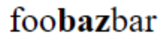
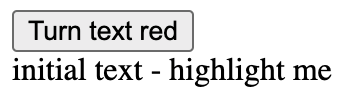

# Shadow Selection API Explainer

Author: Mason Freed

Last updated: September 28, 2021


# Overview


This is an updated and revised version of the original [ComposedSelection API Explainer](https://docs.google.com/document/d/1VuNe7kYK7p6hN7_ozWIbjTLbjU5ctsS0kFwKd1t-8h0) by [yoichio@google.com](mailto:yoichio@google.com). It has been updated to include some [changes agreed to at the 2018 TPAC meeting](https://github.com/WICG/webcomponents/issues/79#issuecomment-432974389), fix some things that have changed since 2018, and generally flesh out the rest of the API.

Shadow DOM (v1) is now supported by all evergreen rendering engines. However, the user selection APIs are not well supported for the case that the user selection crosses shadow boundaries. The existing [Selection API](http://w3c.github.io/selection-api/#dom-selection) specifies that there is [only a single selection](https://w3c.github.io/selection-api/#:~:text=has%20a%20unique%20selection%20associated%20with%20it) in a document and the selection is [bound to a single Range](https://w3c.github.io/selection-api/#:~:text=Each%20selection%20can%20be%20associated%20with%20a%20single%20range), which means that it cannot represent a range over the composed tree. Said another way, if the selection crosses shadow boundaries, the existing API cannot represent this situation correctly. For backwards compatibility, we also can't update the [Range](https://dom.spec.whatwg.org/#range) API to support ranges that cross shadow boundaries, because that could break existing assumptions about ranges.

This proposal suggests a new API that lets web authors control and query selections in the composed tree.


# Examples of problems that occur with the current APIs


## #1. Selecting across an inline shadow component.

Define an inline style component:


```html
foo<span id=host></span>bar
<script>
let root = host.attachShadow({mode: 'open'});
root.innerHTML = `<b>baz</b>`;
</script>
```


This results in a rendered page similar to this:


      

And the user might select the visible text this way:


      

However, in this case, the web author can’t get the exact selection range:


```html
<script>
document.addEventListener("selectionchange", function() {
  window.getSelection(); // ??
});
</script>
```


The call to `getSelection()` in this case behaves differently on different rendering engines. In Chromium, it returns only the content from the DOM tree containing the selection **anchor**. So for the selection that starts between “f” and “o” and ends between “b” and “a”, it will return just “oo”. When selected in the other direction, it just returns “b”. Safari is similar, but will sometimes include the shadow content, if the selection endpoints are in different shadow trees. Gecko will simply **refuse to allow** content to be highlighted as shown above - the user is restricted to selecting only content from one tree or the other, but not across both.


## #2. Editor component inside Shadow DOM.

The following several examples contemplate an editor component, and its need for knowledge of the selection information:


```html
<script>
customElements.define('x-editor', class extends HTMLElement {
  connectedCallback() {
    this.innerHTML = `
      <button>Turn text red</button>
      <div contenteditable="true">initial text - highlight me</div>`;
    this.querySelector('button').onclick = () => {
      let selection = window.getSelection();
      if (selection.rangeCount == 0) return;
      let range = selection.getRangeAt(0);
      range.startContainer.parentElement.style.color = 'red';
    };
  }
});
</script>
<x-editor></x-editor>
```


This creates a simple editor element with a button that can change the style of the selection:



Clicking the button changes the color of the highlighted text's parent element to red:


However, we can’t convert that component to use Shadow DOM:


```html
<script>
customElements.define('x-editor2', class extends HTMLElement {
  constructor() {
    super();
    let shadow = this.attachShadow({mode:"open"}); // Create shadow root.
    shadow.innerHTML = `
      <button>Turn text red</button>
      <div contenteditable="true">initial text - highlight me</div>`;
    shadow.querySelector('button').onclick = () => {
      let selection = window.getSelection(); // ! no shadow info
      //let selection = shadow.getSelection(); // ! not in Gecko or WebKit
      if (selection.rangeCount == 0) return;
      let range = selection.getRangeAt(0);
      range.startContainer.parentElement.style.color = 'red';
    };
  }
});
</script>
<x-editor2></x-editor2>

```


Here, `window.getSelection()` doesn’t work properly/consistently. In some rendering engines (e.g. Chromium and WebKit) the call to `getRangeAt(0)` will return a range that points to the `<body>` element, with node offsets that both point to the `<x-editor2>` element. In this case, our example component therefore changes the entire page to red. In others (e.g. Gecko), it will (magically) return elements within the shadow root, **including** for closed shadow roots. Additionally, in Chromium (only), there is a non-standard implementation of `shadowRoot.getSelection()` which will return selection information within the shadow root, similar to what Gecko returns from `window.getSelection()` in this case. **In no case** is the selection/range information correct when the selection spans two shadow trees.

The same problems happen when the (non-Shadow DOM-based) `<x-editor>` component is nested inside another (Shadow DOM) component:

```html
<script>
customElements.define('parent-component', class extends HTMLElement {
  constructor() {
    super();
    let shadow = this.attachShadow({mode:"open"});
    shadow.innerHTML = '<x-editor></x-editor>';
  }
});
</script>
<parent-component></parent-component>
```

In this case, the `<x-editor>` selection information is no longer available, because the entire component is nested inside a Shadow Root. This makes an otherwise-working component **stop working** based on its location in the composed tree, which is not good.


## #3. Slotted content.

Because the existing `Selection` APIs don't comprehend shadow trees, they also do not properly comprehend slotted content. For example:

```html
<div id=host>Second</div>
<script>
  host.attachShadow({mode:"open"}).innerHTML = 'First <slot></slot> Third';
</script>
```

In this example, "Second" is slotted into the `<slot>` between "First" and "Third". So if the user highlights part of the results (if that is even possible in the browser), the rendered text looks like this:


Clearly, in this case, the user sees the highlight covering part of "Second" and part of "Third". However, the results of `getRangeAt()` vary wildly, as does the behavior of each browser while trying to highlight this particular portion of the text. Note that in this case, if the user selected **from** "Second" **to** "Third", then the `anchorNode` would be in the light DOM on the Text Node for "Second", while the `focusNode` would be in the shadow DOM on "Third". This is in some sense "reversed" from the perceived DOM tree order:


This selection might even skip over other nodes that are in the light dom (e.g. siblings of "Second") that are **not** slotted into the shadow tree, and therefore invisible to the user.

# Proposal

This is a two-part proposal.

## Part 1: Add `Selection.getComposedRange()`


```webIDL
partial interface Selection {
  StaticRange getComposedRange(optional sequence<ShadowRoot> closedRoots = []);
};
```


This a new API, `getComposedRange()`, which can return a [`StaticRange`](https://developer.mozilla.org/en-US/docs/Web/API/StaticRange) with endpoints in **different shadow trees**. Because that might expose `Node`s inside `closed` shadow trees, an optional `closedRoots` parameter enables the method to return `Node`s within the provided list of closed roots, if necessary. If a selection endpoint is within a non-provided `closed` shadow root, the returned selection will be ["re-scoped"](#re-scoping) as if the entire host element was selected.

## Part 2: Modify existing `Selection` APIs accordingly

In addition to this new API for retrieving a composed (cross-tree) selection, some of the existing APIs within the `Selection` object will be updated to support selections that cross shadow boundaries. For example, the `setBaseAndExtent()` function will be updated to support `anchorNode` and `focusNode` living in different shadow trees. [This section](#changes-to-existing-selection-apis) of the explainer goes into detail for each API.

But first, let’s see how the new `getComposedRange()` API can be used with the problem examples above:


# Examples, in the context of the new proposal

## #1. Selecting across an inline shadow component.


With the new API, the exact selection range can be accessed:

```html
<script>
document.addEventListener("selectionchange", function() {
  let composedRange = window.getSelection().getComposedRange();
  console.log(composedRange); // {"foo", 1, "baz", 1}
});
</script>
```

You can also programmatically set the same type of cross-tree selection:

```html
<script>
window.getSelection().setBaseAndExtent(foo, 1, baz, 1);
</script>
```

## #2. Editor component inside Shadow DOM.

With a simple code change, the existing example "just works":

```html
<script>
customElements.define('x-editor2', class extends HTMLElement {
    ...same as before...
    shadow.querySelector('button').onclick = () => {
      let selection = window.getSelection();
      let range = selection.getComposedRange(); // NEW API CALL HERE
      range.startContainer.parentElement.style.color = 'red';
    };
  }
});
</script>
<x-editor2></x-editor2>
```

Here, the `getComposedRange()` call returns the correct range, even when the selection crosses shadow boundaries.

If the `<x-editor2>` component were to be implemented using a `closed` shadow root, then the `closedRoots` parameter could be used to "unlock" access to the component's own shadow root:

```html
<script>
customElements.define('x-editor2', class extends HTMLElement {
    ...same as before, but with a **closed** shadow root...
    shadow.querySelector('button').onclick = () => {
      let selection = window.getSelection();
      let range = selection.getComposedRange(closedRoots: [shadow]); // NEW API CALL HERE
      range.startContainer.parentElement.style.color = 'red';
    };
  }
});
</script>
<x-editor2></x-editor2>
```

This example code will work both for the shadow-DOM-containing example `<x-editor2>` as well as the non-Shadow-DOM `<x-editor>` placed within a shadow root. I.e. it should be a complete replacement for the legacy `getRangeAt()` API.

## #3. Slotted content.

In the case of slotted content, the `getComposedRange()` API will return nodes in different shadow trees, **and a [flat tree traversal](https://drafts.csswg.org/css-scoping/#flat-tree)** will be understood to be the correct way to walk the selected nodes from `anchorNode` to `focusNode` (if needed). For example, using a modified version of our previous slotted text example: 

```html
<div id=host>Second</div>
<script>
  const shadow = host.attachShadow({mode:"open"});
  shadow.innerHTML = 'First <slot></slot> Third';
  const third = shadow.querySelector('slot').nextSibling;
  let selection = window.getSelection();
  // This will select from "Second" to "Third": 
  selection.setBaseAndExtent(host, 3, third, 4);
  selection.getComposedRange(); // {host, 3, third, 4}
</script>
```

So the new `getComposedRange()` API works correctly here, too, so long as the application understands that these nodes may appear out of order or appear to include extra nodes, unless the range is traversed using a [flat tree traversal](https://drafts.csswg.org/css-scoping/#flat-tree).


# "Re-scoping"

If the `closedRoots` parameter of `getComposedRange()` is not used, or if the provided value does not contain a given `closed` shadow root, then selections that cross such closed shadow roots will be **"re-scoped"** to enclose the corresponding shadow host element. That is to say, the returned `StaticRange` will be constructed as if the entire shadow host element is selected; neither the starting nor ending nodes of the `StaticRange` will reside within that shadow root.

To avoid this behavior for `closed` shadow roots, the `closedRoots` parameter can be used to allow `getComposedRange()` to return `Node`s within the provided roots. In the case of multiple nested `closed` `shadowRoot`s, only the lowest level `shadowRoot` is required in order to "reveal" higher level roots. For example, suppose we have this DOM tree:


For this tree:

```html
<script>
let selection = window.getSelection();
selection.setBaseAndExtent(C, 1, I, 1); // Select after-node-D through after-node-J
// Passing no arguments, open shadow roots are included, but closed roots aren't:
selection.getComposedRange(); // [C, 1, A, 2] - node E is closed, but B is open
// Now, include closedRoots:
selection.getComposedRange(closedRoots: [G]); // [C, 1, G, 1] - no knowledge of I 
selection.getComposedRange(closedRoots: [I]); // [C, 1, I, 1] === original range, G not needed
// Since G only contains H, which is not a <slot>, F does not get slotted/rendered:
selection.containsNode(F); // false (see example #3 above)
</script>
```

# Changes to existing Selection APIs

This proposal adds only one *new* API, `getComposedRange()`. But it also modifies several *existing* Selection APIs to comprehend the composed tree. In general, the model for this proposal is to *change* the Selection API algorithms so that **internally**, the range is stored as a *composed* `StaticRange` with endpoints that can span **all** (including `closed`) shadow trees. And then the existing and new APIs discussed here ["re-scope"](#re-scoping) that actual full range to match platform expectations. For example, for backwards-compatibility, `Selection.getRangeAt()` should still return a *live* `Range` that is scoped to a single tree. And `Selection.getComposedRange()` should return a `StaticRange` that ["re-scopes"](#re-scoping) over (non-provided) `closed` shadow roots.

Here is a list of the existing Selection APIs that would be modified by this proposal:

- Modify behavior to maintain backwards-compatibility:
    - `Selection.getRangeAt()` - This function will be changed to return a single-tree `Range` object, by [re-scoping](#re-scoping) over any nodes in the range that are in different shadow trees. In other words, this will return a `Range` that is equivalent to the `StaticRange` that would be returned by a call to `getComposedRange()`, if all contained Shadow Roots were replaced by `closed` Shadow Roots, and no `closedRoots` parameter were provided.
    - `Selection.anchorNode/anchorOffset/focusNode/focusOffset` - because these currently always return `Node`s in the same shadow tree, they need to maintain that behavior. They should be re-defined to return the endpoints/offsets of the range returned by `Selection.getRangeAt(0)`.

- Update behavior to "just work" for cross-tree selections:
    - `Selection.setBaseAndExtent()` - this will now accept `anchorNode` and `focusNode` arguments that reside in different shadow trees, which will set the selection accordingly.
    - `Selection.collapse()` - can now accept a node in any tree, and will collapse the range to that `Node`.
    - `Selection.collapseToEnd()/collapseToStart()` - These will be updated to work as expected for selections that include cross-tree endpoints.
    - `deleteFromDocument()` - This should work as-expected, even if range endpoints are in different trees.
    - `extend()` - This should work as-expected, even if the new `focusNode` is in a different shadow tree.

- Perhaps more nuanced:
    - `Selection.containsNode()` - This must be modified to work correctly for slotted content, in addition to general cross-tree selections. For example, if an un-slotted child of a `Node` in the range is queried, this method should return `false`, even though that child is reachable in a tree-of-trees walk from `anchorNode` to `focusNode`. Since it is not slotted, the user does not see it, so it should not be considered to be part of the selection. Since the previous behavior was unaware of shadow trees entirely, this does not seem like much of a compat risk.
    - `Selection.modify()` - Given the lack of a spec for this feature, I propose we not change its behavior.

- No change needed/desired:
    - `Selection.removeRange()/removeAllRanges()` - Should continue to work as-is.
    - `Selection.selectAllChildren()` - Should already result in a single-tree `Range` - no changes needed.
    - `Selection.toString()` - No change needed.
    - `Selection.addRange()` - Since this method is fairly legacy and [only supports a single range](https://www.w3.org/TR/selection-api/#dom-selection-addrange) (by spec and in 2/3 engines), we should leave this API as-is, and **not** update it to support cross-tree ranges.


# Web Compatibility Risk

There is a (hopefully small) web compatibility risk from making the proposed changes. Some of the changes proposed above **do** change the behavior of these APIs in the case where cross-tree nodes are **currently/already** being used. The behavior in these cases will likely change if this proposal is adopted. However, given that using cross-tree nodes in Selection APIs is not currently specified, and doesn't work in any browser at the moment, hopefully the prevalence of this in the wild is small. The primary Selection API use cases (e.g. calling `getRangeAt(0)`) should not be adversely affected by these changes.


# Appendix

## Helpful/Related Links

- [Main issue #79 for Selection APIs and Shadow DOM](https://github.com/WICG/webcomponents/issues/79)
- [Add `getComposedRange`](https://github.com/w3c/selection-api/issues/98)
- [Change `setBaseAndExtent`](https://github.com/w3c/selection-api/issues/99)
- [Clarify how new APIs relate](https://github.com/w3c/selection-api/issues/2)

- Here is a [2018 Editor library compatibility investigation](https://github.com/webcomponents/shadydom/issues/113#issuecomment-427066346) and related editor issues:
    - Quill: [quilljs/quill#2021](https://github.com/quilljs/quill/issues/2021)
    - Trix: [basecamp/trix#403](https://github.com/basecamp/trix/issues/403)
    - CKEditor: [ckeditor/ckeditor5-engine#692](https://github.com/ckeditor/ckeditor5-engine/issues/692)
    - Prosemirror: [ProseMirror/prosemirror#476](https://github.com/ProseMirror/prosemirror/issues/476)
    - Squire: [neilj/Squire#327](https://github.com/neilj/Squire/issues/327)

- There is also this "polyfill", which doesn't actually polyfill any proposed spec, but instead makes `shadowRoot.getSelection()` work on non-Chromium browsers:
    - https://www.npmjs.com/package/shadow-selection-polyfill
